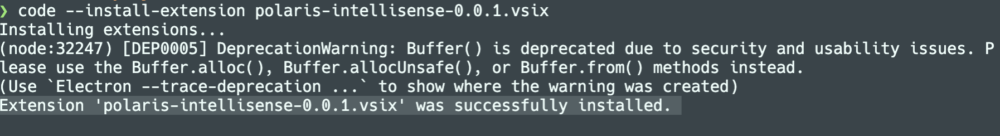
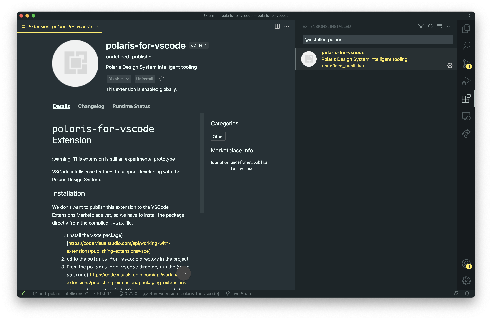

# `polaris-for-vscode` Extension

:warning: This extension is still an experimental prototype

VSCode features to support developing with the Polaris Design System.

## Development instructions

1. Download the `polaris-react` project
2. Open the `polaris-react/polaris-for-vscode` directory in a VSCode window
3. Run the `generateCustomPropertyNames` script to create the tokens file

```bash
yarn run generateCustomPropertyNames
```

4. Run the build command with `cmd + shift + B`. This will start the server in watch mode.
5. Press `F5` to run the client using the [VSCode debugger](https://code.visualstudio.com/api/get-started/your-first-extension#debugging-the-extension). This will open up a new `Extension Development Host` window
6. Open a `.css` or `.scss` file of your choosing in the `Extensions Development Host` window
7. Start typing the extension trigger characters `--p` to bring up the Polaris custom properties autocomplete

## Installation

We don't want to publish this extension to the VSCode Extensions Marketplace yet, so we have to install the package directly from the compiled `.vsix` file.

1. (Install the `vsce` package)[https://code.visualstudio.com/api/working-with-extensions/publishing-extension#vsce]
2. `cd` to the `polaris-for-vscode` directory in the project.
3. From the `polaris-for-vscode` directory run the (`vsce package`)[https://code.visualstudio.com/api/working-with-extensions/publishing-extension#packaging-extensions] command in your terminal. After running you should have a new `.vsix` file in the directory (ex. `polaris-for-vscode-0.0.1.vsix`)
4. To install the extension run `code --install-extension EXTENSION_FILENAME.vsix`

```bash
# example of running install command
code --install-extension shopify-dev-intellisense-0.0.1.vsix
```


3.After running the code command you should see a success message. To ensure the extension was installed, open your VSCode Extension manager from the sidebase and search `@installed shopify-dev-intellisense`.

